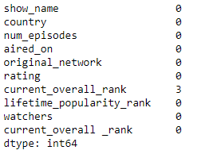
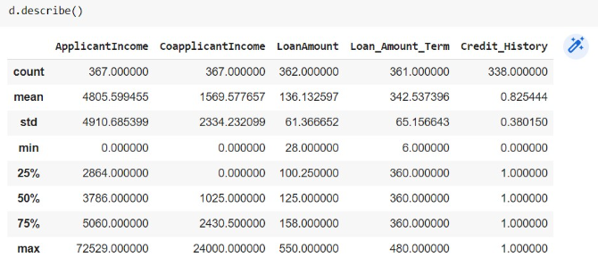
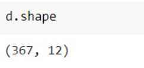
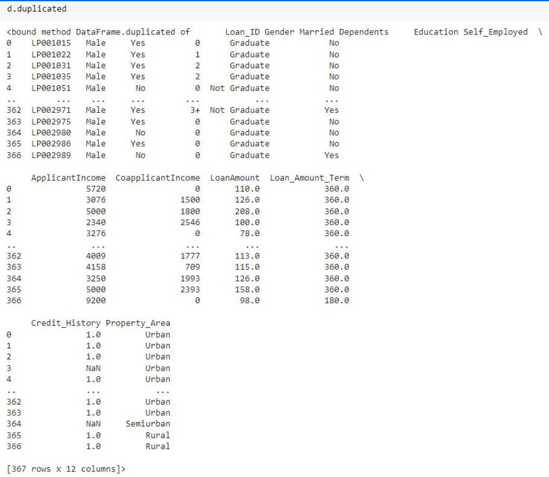
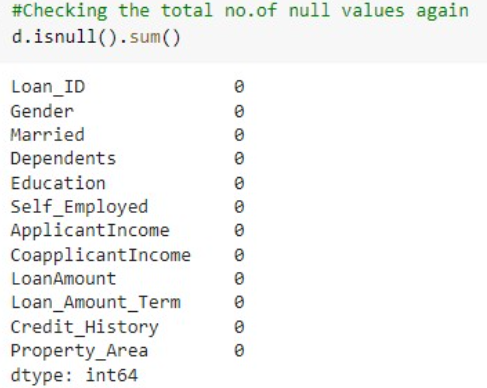

# Ex-01_DS_Data_Cleansing
# AIM
To read the given data and perform data cleaning and save the cleaned data to a file.

# Explanation
Data cleaning is the process of preparing data for analysis by removing or modifying data that is incorrect ,incompleted , irrelevant , duplicated or improperly formatted. Data cleaning is not simply about erasing data ,but rather finding a way to maximize datasets accuracy without necessarily deleting the information.

# ALGORITHM
## STEP 1
Read the given Data

## STEP 2
Get the information about the data

## STEP 3
Remove the null values from the data

## STEP 4
Save the Clean data to the file

# CODE FOR DATA 1:
```
Developed by :R.HEMAPRIYA
Registration Number : 212221230036
```
```
import pandas as pd
df=pd.read_csv("Data_set.csv")
df.head(5)

df.info()

df.isnull()

df.isnull().sum()

df['show_name']=df['show_name'].fillna(df['aired_on'].mode()[0])
df['aired_on']=df['aired_on'].fillna(df['aired_on'].mode()[0])
df['original_network']=df['original_network'].fillna(df['aired_on'].mode()[0])
df.head()

df['rating']=df['rating'].fillna(df['rating'].mean())
df['current_overall _rank']=df['current_overall_rank'].fillna(df['current_overall_rank'].mean())
df.head()

df['watchers']=df['watchers'].fillna(df['watchers'].median())
df.head()

df.info()

df.isnull().sum()
```
# OUTPUT FOR DATA 1:

DATA:


NON NULL BEFORE:


MODE:


MEAN:


MEDIAN:


NON NULL AFTER:





#CODE FOR DATA 2:

import pandas as pd
import numpy as np
import seaborn as sns
d = pd.read_csv("/content/Loan_data.csv")
d
d.head()
d.describe()
d.tail()
d.isnull().sum()
d.shape
d.columns
d.duplicated

#Using mode method to fill the data in columns as Object(String)
#mode()[0] - Takes the most reccuring value and fills the empty cells
d['Gender'] = d['Gender'].fillna(d['Gender'].mode()[0])
d['Dependents'] = d['Dependents'].fillna(d['Dependents'].mode()[0])
d['Self_Employed'] = d['Self_Employed'].fillna(d['Self_Employed'].mode()[0])

#Using mean method to fill the data
d['LoanAmount'] = d['LoanAmount'].fillna(d['LoanAmount'].mean())
d['Loan_Amount_Term'] = d['Loan_Amount_Term'].fillna(d['Loan_Amount_Term'].mean())
d['Credit_History'] = d['Credit_History'].fillna(d['Credit_History'].mean())

sns.boxplot(y="LoanAmount",data=d)

#Checking the total no.of null values
again
d.isnull().sum()

#Checking info of the dataset to check all the columns have entries
d.info()


#OUTPUT:











# RESULT:
Thus the given data is read,cleansed and cleaned data is saved into the file. 


